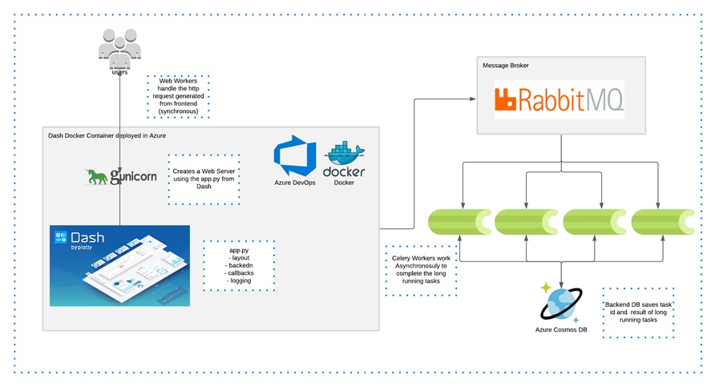
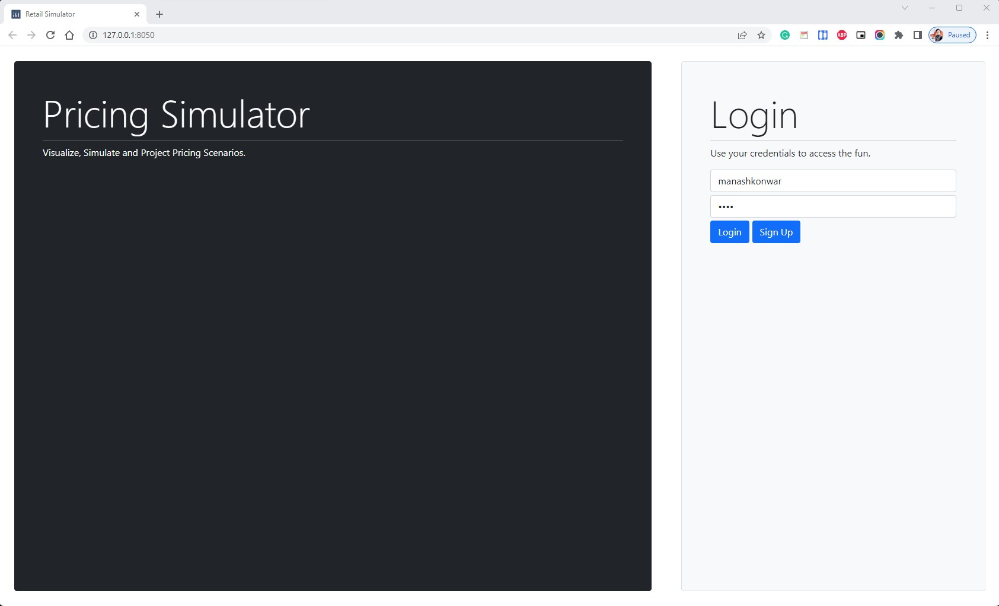
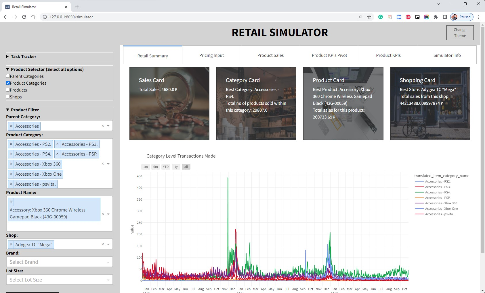
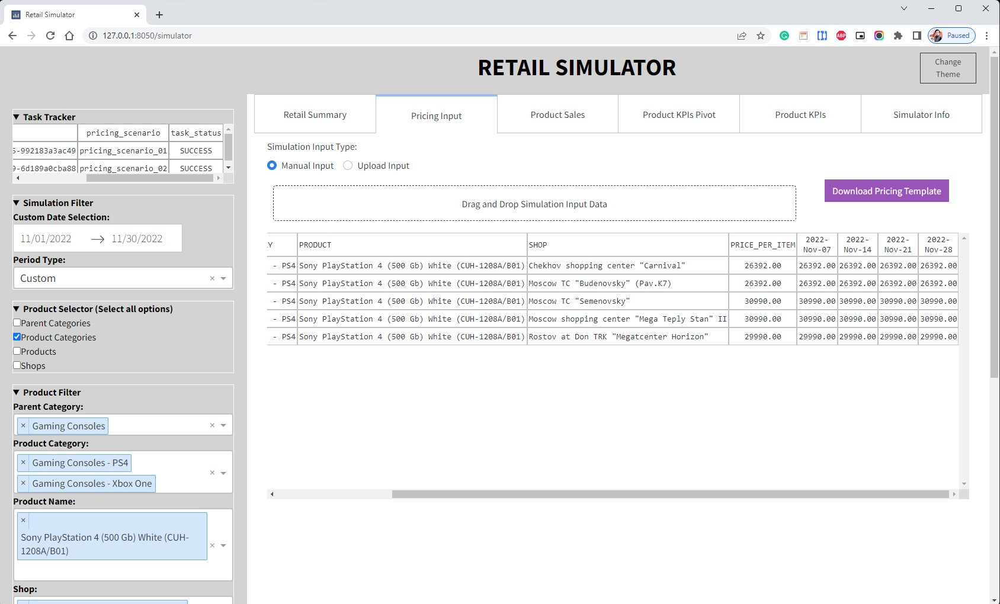
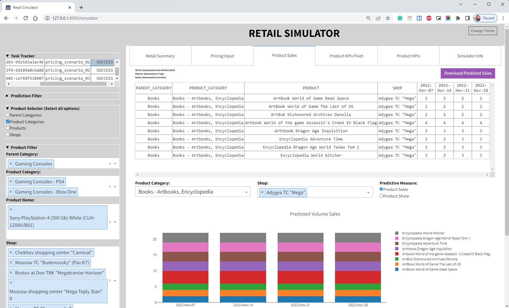
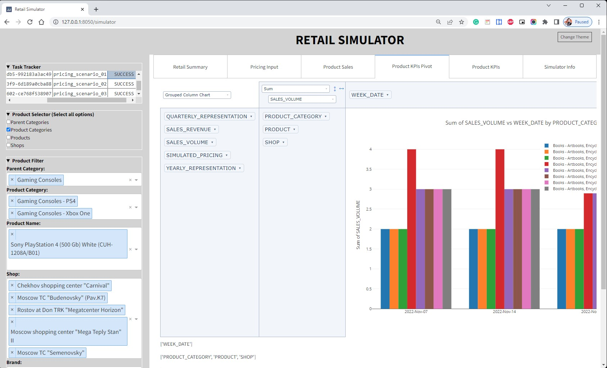
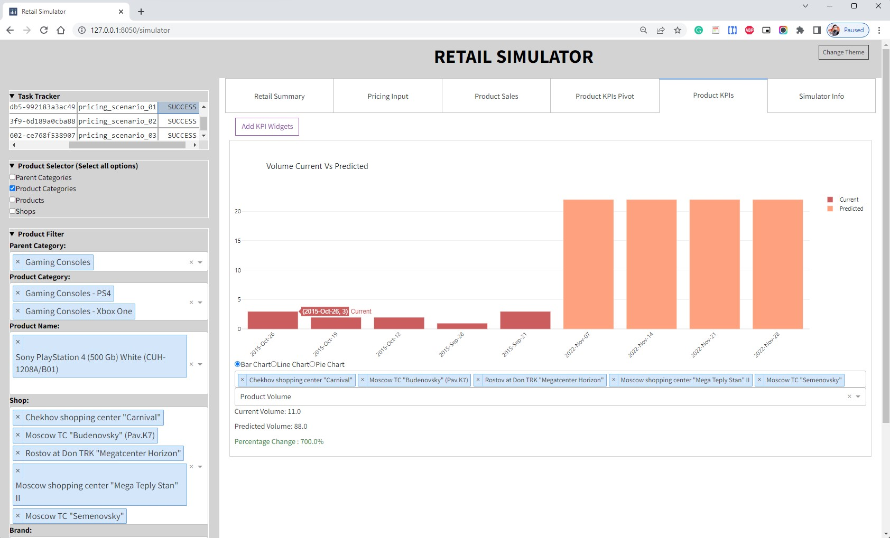

# **Retail Pricing Simulator / Optimizer**
Retail Pricing Simulator/ Optimizer is developed so that business scenarios or decisions made across pricing of products could be easily rendered and visualized, thereby enabling users to simulate real time scenarios and leverage the power of ML to forecast the demand in near future. It could also be a one stop soution for optimizing prices of products so as to maximize the profit margins thereby resulting in higher amount of product sales.

## **Key Features**
- Built in pure Python using Plotly Dash and deployed to Azure Cloud Instance.
- Execution of long-running tasks is achieved asynchronously by background jobs via Celery as worker, Rabbitmq as Broker and Redis as Backend.  
- Can support multiprocessing, concurrency by use of celery pools such as gevent and prefork.  
- Robust front end and backend with modular coding structure. Hence, easily scalable.  
- Dynamic Widget process helps to reduce load on front load and achieved by pattern-based callbacks.  
- Uses Snowflakes connector to ingest data from database.  
- Interactive graphing and figure capture to quickly visualize and share data  
- Multi-browser functionality. Manually tested on Chrome 90, Edge and Firefox.

## **Live demo** 
[GIF here](https://www.example.com).

## **Table of Contents**
* [General Info](#general-information)
    * [What does this Retail Simulator / Optimizer?](#what-does-this-retail-simulator--optimizer)
    * [Business case it serves](#business-case-it-serves)
* [Platform Architecture](#platform-architecture)
* [Technologies Used](#technologies-used)
* [Features](#features)
* [Screenshots](#screenshots)
* [Setup](#setup)
* [Dataset Utilized](#dataset-utilized)
* [Usage](#usage)
* [Project Status](#project-status)
* [Room for Improvement](#room-for-improvement)
* [References](#references)
* [Acknowledgements](#acknowledgements)
* [Contact](#contact)
* [License](#license)

## **General Information**
- The aim of this repository is to help AI/ML researchers develop historical dashboarding for retail data and also generate an inferencing simulator which would connect directly to databases and deployed models to generate demands.
- The second crucial point is an insight into how to optimize prices of products seen in retail industry.
- The third selling point is the utilization of DASH which is a python framework running Flask as web server, React JS as frontend and Plotly JS as visualization modules. This eliminates the requirement of web developers in intial designing and prototyping stage and could help data scientists to build a quick MVP to address pricing related case studies.

### **What does this Retail Simulator / Optimizer?**  
Retail Simulator / Optimizer is an web application which helps us to simulate different pricing scenarios for specific SKUs/Brands/Products along with dynamic calculation of pricing features such as Price Ratios/Seasonality/Price Lags which enables a business/finance manager to utilize developed AI models for evaluating predicted volumes/shares and also project important KPIs which would help them to make futuristic decisions to uplift sales.  
It would also help us to optimize pricing of products so as to uplift the revenue and sales numbers.

### **Business case it serves**  
- Helps Promote Business by making use of generated AI models.
- Analyze Historical sales trend in retail POS data.
- Presents Predicted figures to accommodate pricing projections by making use of interactive visualizations and data representations.

## **Platform Architecture**
  

Dash is a single threaded python process so any use of multthreading would just initiate another instance of the web application. So, to perform concurrent operations its better to tkae it away from dash working environment and submit any long running task to a celery worker.  

To attain this asynchronous behaviour, we need to setup 3 components so as to make a scalable setup. This is achieved by setting up a messaging broker which would help us to carry this long running task and submit the same to the celery worker. The most common choice of messaging broker is rabbitmq since it is able to carry heavy payload and is highly scalable. The 3 most essential compoenents of messaging broker are producer, consumer and queue/topic.   

In this scenario, the dash web application acts as producer which is responsible to submit simulation scenarios to the messaging queue. The queue absorbs this message and the consumer which is none other than celery workers act as consumers. By default, we have intorduced 4 celery workers, which means we can run 4 simulataneous simulation at once. If the number of incoming messages to the queue is greater than 4, rabbitmq makes sure to maintain the task queue and once any of the worker gets free, it absorbs the next simualation task. Four workers are set by default however, it is suggested to adjust the no of workers based on machine capability (mostly have it atleast equal to avaialble no of cores - 1).  

## **Technologies Used**
- Python
- Dash 
- Rabbit MQ
- Redis
- PostgreSQL
- Celery

## **Features**
List the ready features here:
- Retail Data Summarization - <mark>**Done**</mark>
- Pricing Scenario Simulation - <mark>**Done**</mark>
- Pricing Scenario Results Pivotting - <mark>**Done**</mark>
- Pricing Scenario Results KPI - <mark>**Done**</mark>

List the in progress features here:
- Price Optimization - <mark>**In Progress**</mark>

## **Screenshots**

- Application Related  
      
- Business Scenario Related  
      
      
      
    
      
    

## **Setup**
- git clone https://github.com/ManashJKonwar/ML-Retail-Pricing-Simulator.git (Clone the repository)
- python3 -m venv MLPricingVenv (Create virtual environment from existing python3)
- activate the "MLPricingVenv" (Activating the virtual environment)
- pip install -r requirements.txt (Install all required python modules)

## **Dataset Utilized**

## **Usage**

## **Project Status**
Project is: __in progress_ 

## **Room for Improvement**

## **References**

## **Acknowledgements**

## **Contact**
Created by [@ManashJKonwar](https://github.com/ManashJKonwar) - feel free to contact me!

## **License**
This project is copyrighted property and free surfacing of the product is not allowed.